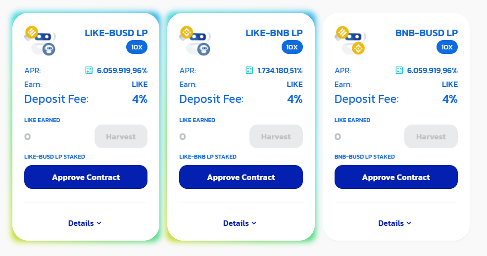

# Farms

**Initial Liquidity Pools \(LPs\) for farming LIKE tokens:**

**Reward multipliers:**

- LIKE (10x Rewards)
- LIKE-BUSD (40x Rewards)
- LIKE-BNB (24x Rewards)
- BNB-BUSD (5x Rewards)
- DAI-BUSD (4x Rewards)
- BETH-ETH (4x Rewards)
- CAKE-BUSD (4x Rewards)
- CAKE-BNB (2x Rewards)
- BUSD (2x Rewards)
- BNB (1x Rewards)
- CAKE (1x Rewards)
- DAI (1x Rewards)

[LikeSwap](https://likeswap.org/farms) collects a 3% deposit fee to periodically purchase LIKE on the market and burn them.

This will reduce the supply and pump your bags!

[Get your FLIP tokens \(LikeSwap Liquidity Provider Tokens\) here](https://app.likeswap.org/#/swap)
